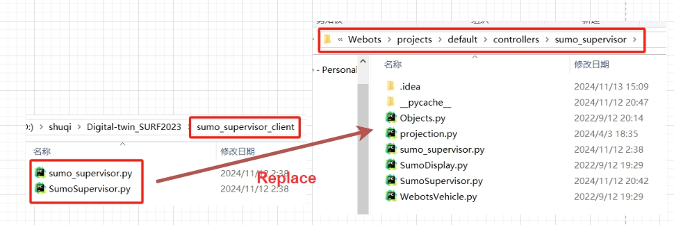
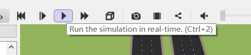

# Guide_for_Webots     
**————————SURF2023—————————**   
### This is the repository which stores the resource codes and records the processes of development    
### Besides, the detailed document to guide you how to start with Webots is in Wiki


## Tutorial for scenario tests (Windows 10 and Python3.9 are used as an example)

## 1. Install necessary dependencies.

```python
pip install -r requirements.txt
```

## 2. Download Webots 2022b and SUMO 
Download Webots **2022b** version from [Webots official website](https://github.com/cyberbotics/webots/releases) and Simulation of Urban MObility(SUMO) from [SUMO official website](https://sumo.dlr.de/docs/Downloads.php). And add them into environment variable `PATH`.

**Notice:** The difference in the versions of Webots and SUMO may lead the incompatible for the Webots `map` and `.proto` file.


## 3. Configure the **PROTO** file
Copy or replace the folder `protos` into the path `Webots\projects\vehicles`


## 4. Copy the `font` folder to your `desktop` so that the HUD can use it.
This folder contains various fonts. For HUD controller able to find the font path, please copy them to your desktops. Of course, you can change the code from controller python file. For instance, if you are the server-side, you can open `server\controllers\Webots_HUD\Webots_HUD.py` and adjust the corresponding codes.


## 5. SUMO_supervisor file update
Replace the `Sumoupervisor.py` file in the folder `Webots\projects\default\controllers\sumo_supervisor`

**Notice:** For the `Server` side, you should copy the `Sumoupervisor.py` from the repository `SumoSupervisor_server`; For the `Client` side, uou should copy the `Sumoupervisor.py` from the repository `SumoSupervisor_client`.




## 6. Whole scenario observation
If you want to see the whole scenario, you should open the map from repository `xipuMap/myMap/worlds/myMap.wbt`

**If the configuration are well done, you will see a pop-up SUMO interface and generating traffic flow.**


## 7. Test-Scenario reproduction 
If you want to test the test-scenario by yourself, you should do the following step. Make sure you already have Logitech G29 Steering wheel and pedals, connect them to the computer.

**Notice:** both server-side and client-side should be involved in the same LAN. Make sure you can ping each other.

### 7.1 Download drive program or Logitech client 
Download drive program or Logitech client from [Logitech official website](https://www.logitechg.com/en-us/innovation/g-hub.html) and plug in the hardwares to computers. Since we have updated the previous steering wheel controlling logic from C++ to Python, after downloading the driver, in the software, it is a plug-and-play process.

### 7.2 Adjust the Ip address in `SumoSupervisor.py`
In file `SumoSupervisor.py`, change the value of parameter `host` to corresponding ip address. For instance, if server's ip address is 192.168.0.1, the client's ip address is 192.168.0.3. The `SumoSupervisor.py` in server-side should fill in "192.168.0.3".

The address after changing should be like the following:

**traci.init(port, numRetries=5, host="192.168.0.3")**


### 7.3 Click to pause the simulation
After the first time entering the simulation scenario, click the `pause the simulation` button instantly.


### 7.4 Open the test-scenario and replace the proto files
Open the world file `Test_Platform/worlds/school.wbt` by using Webots 2022b. As shown in Figure, the red car represents the vehicle equipped with HUD. Click this red vehicle, right click and choose `Edit Proto Source` so that you can see the proto in the righr of the screen. 

Replace the content in Bmw X5.proto from it in the repository. So as the other vehicles (the green one and blue one). Save them and restart Webots simulation.


### 7.5 Change the sequences of vehicles
After restart Webots simulation, wait for the SUMO to generate the first vehicle from the starting point. After running for a while (about 3 seconds), click `pause the simulation` and then drag the remaining 3 vehicles to appropriate position so that the totel 4 vehicles are arranging as a platoon.


### 7.6 Test by using the wheel and pedals
Click `run the simulation in time` to continue the simulation. Then, use Logitech wheel and pedals to have test.



# Start your test and enjoy your Webots journey!

